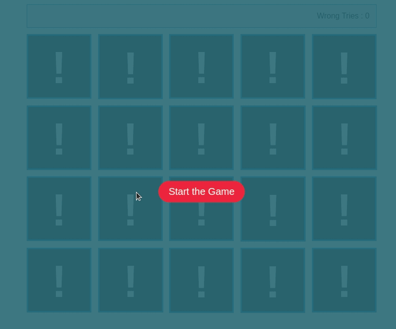

# _Memory Game_
#### Table of contents
* [General info](#general-information)
* [Technologies](#Technologies)
* [Setup & Launch](#Setup)
* [Preview](#Preview)
#### Preview


#### General information
Fun game using Front-end technology logos as flash cards.
It's fun and suitable for all age groups. (I made another one using Disney Catoons characters to appeal to the younger kids category with different sound effects).
#### Technologies
Actually , it's very simple project using only:
- HTML.
- CSS.
- JavaScript.

#### Setup
This app runs smoothly on the local environmment, so no need for any special setup.
```
You can use Live-Server extention from your IDE
```
 

```
Or simlpy By double click the HTML file
```
Also you can find a production versioin below:
| Platform | Link |
| ------ | ------ |
| Heroku | www.heroku/pas/encore.com


**Enjoy & Have Fun !**

